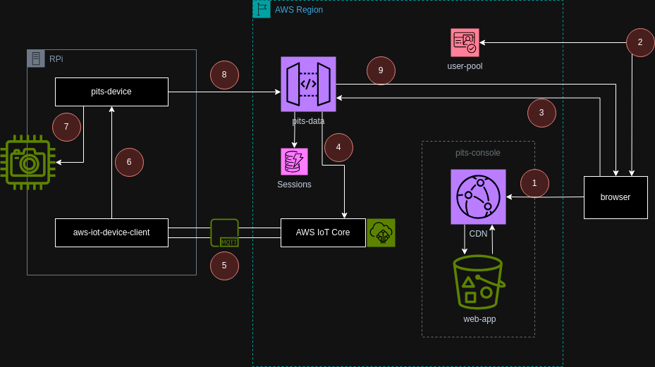

# Pi In The Sky - Data

The data plane API for the Pi In The Sky application

## Architecture

The high level dataflow travels from right to left, starting at
the browser:

1. The user requests the [pits-console][1] application at the domain (AWS provided to custom) to the CDN.
2. Once the application loads, the user must login through AWS Cognito User Pool
3. The application makes an uathorized `connect` to the `pits-data` websocket server.
4. The connection session is stored in `PitsResources` DynamoDB provided by [pits-infra][2]. Additionally, a command to wake the [pits-device][3] application using an AWS IoT MQTT message
5. The message is receied by `aws-iot-device-client` via MQTT and written as a JSON file on the device
6. The JSON file mutation is handled as an internal event through inotify.
7. The `pinthesky` daemon processes the event and wakes the `picamera` device.
8. The camera feed is bumped directly into a websocket
9. The feed is forward to the browser session and ultimately rendered
as real-time in the browser.

[1]: https://github.com/philcali/pits-console
[2]: https://github.com/philcali/pits-infra
[3]: https://github.com/philcali/pits-device